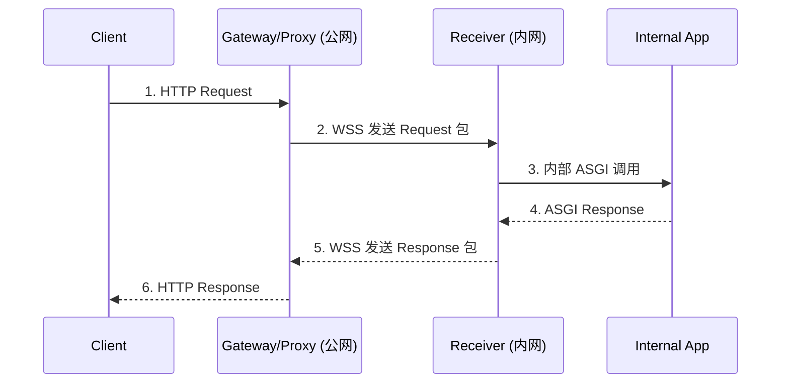

### 一、要解决的核心问题

| 编号 | 痛点描述                                           | 影响                                  |
| ---- | -------------------------------------------------- | ------------------------------------- |
| P1   | **局域网 Agent 无公网接口**，难以被外部调用        | 能力无法对外暴露，阻碍生态互联        |
| P2   | **HTTP ↔ 内部服务** 协议不统一，部署受限于框架     | 每换一套框架就要重写代理逻辑          |
| P3   | **NAT / 防火墙穿透复杂**                           | 传统端口映射或 VPN 方案成本高、不稳定 |
| P4   | **安全与多路复用**：明文 WebSocket、不限流、无鉴权 | 容易被劫持或拖垮服务                  |

---

### 二、总体目标

1. **框架无关**：前后端可用任何语言 / 框架，只需遵守统一消息格式。
2. **全量转发**：完整封装 HTTP 方法、路径、Headers、Query、Body 与响应信息。
3. **安全可靠**：WSS（TLS）+ 双向鉴权 + 请求 ID 配对 + 断线重连。
4. **高性能异步**：纯异步 IO、单连接多并发、无磁盘落地。

---

### 三、架构概览

```text
┌────────────┐            WSS (TLS)           ┌──────────────┐
│  Client    │ ─HTTP→ ┌──────────────┐ ─────→ │  Receiver &  │
│  外部调用者  │        │Gateway/Proxy │        │  Internal App│
└────────────┘ ←HTTP─ └──────────────┘ ←───── │  (FastAPI …) │
                 ↑                ↓           └──────────────┘
           Request 包装       Response 包装
```

- **Gateway/Proxy（公网）**

  - 监听所有 HTTP 请求
  - 打包后通过 **WSS** 发送给后端
  - 收到响应包后还原成 HTTP 返回给 Client

- **Receiver（内网）**
  - 维持 WSS 长连接，接收打包请求
  - 还原并**内部调用**本地 Web 框架（示例：`httpx.AsyncClient(app=fastapi_app)`）
  - 将框架返回内容打包为响应，通过 WSS 返还

---

### 四、消息格式

使用二进制详细，详细见相关文档。

[消息格式](./proxy-protocol.md)

---

### 五、关键流程

| 步骤 | 参与方             | 说明                                                      |
| ---- | ------------------ | --------------------------------------------------------- |
| 1    | Gateway            | 收到外部 HTTP 请求 → 解析五元组 → 生成 `request_id`       |
| 2    | Gateway → Receiver | 通过 WSS 发送 **Request 包**                              |
| 3    | Receiver           | 解包 → 用 `httpx.AsyncClient(app=local_app)` 伪造内部请求 |
| 4    | Internal App       | 正常执行业务逻辑，返回 ASGI Response                      |
| 5    | Receiver           | 打包为 **Response 包**（带同一 `request_id`）             |
| 6    | Receiver → Gateway | WSS 发送 Response 包                                      |
| 7    | Gateway            | 还原 HTTP 响应 → 回给外部 Client                          |

#### 时序图（文本示意）

```text
Client            Gateway/Proxy          Receiver             Internal App
                    （公网）             （内网）
 |                     |                    |                      |
 |---1. HTTP Request-->|                    |                      |
 |                     |---2. WSS Request-->|                      |
 |                     |                    |---3. ASGI Call------>|
 |                     |                    |<--4. ASGI Response---|
 |                     |<--5. WSS Response--|                      |
 |<--6. HTTP Response--|                    |                      |
```



### 六、技术选型与实现要点、技术选型与实现要点、技术选型与实现要点

| 组件     | 建议库                                | 备注                              |
| -------- | ------------------------------------- | --------------------------------- |
| WSS 通道 | `websockets` / `starlette.websockets` | 支持 TLS、Ping/Pong、断线自动重连 |
| 请求封装 | `pydantic` / `dataclasses-json`       | 统一 Schema，易扩展               |
| 内部调用 | `httpx.AsyncClient(app=app)`          | 0 复制 ASGI 路径，高性能          |
| 流控限速 | `asyncio.Semaphore`                   | 防止单连接拖垮后端                |

### 七、快速开始

#### 环境要求

- Python 3.11+
- UV 包管理器
- 配置文件 `config.toml`（必需）

#### 安装和运行

```bash
# 克隆项目
git clone <repository-url>
cd anp-proxy

# 安装依赖
uv sync

# 运行服务（从 config.toml 加载配置）
uv run anp-proxy
```

#### 启动方式

**1. 标准启动**
```bash
uv run anp-proxy
```

**2. 管理脚本启动（生产环境推荐）**
```bash
# 后台启动
./manage.sh start

# 查看状态
./manage.sh status

# 停止服务
./manage.sh stop

# 重启服务
./manage.sh restart

# 查看日志
./manage.sh logs
```

**3. 开发模式**
```bash
# 直接运行 CLI
python anp_proxy/cli.py
```

#### 配置文件

项目根目录下的 `config.toml` 文件包含所有配置：

```toml
# 运行模式：目前仅支持 gateway
mode = "gateway"

# 调试模式
debug = false

[logging]
level = "INFO"
format = "%(asctime)s [%(levelname)s] %(name)s: %(message)s"
log_dir = "logs"

[gateway]
# HTTP 服务器设置
host = "0.0.0.0"
port = 9877

# 连接限制
max_connections = 100
timeout = 120.0
keepalive_timeout = 60.0

[gateway.tls]
tls_verify_mode = "required"

[gateway.database]
host = "your-database-host"
port = 3306
user = "username"
password = "password"
database = "did_db"
charset = "utf8mb4"
connect_timeout = 5.0
min_connections = 2
max_connections = 20
```

#### 启动流程说明

1. **配置加载**：CLI 从 `config.toml` 加载配置 (`anp_proxy/cli.py:44`)
2. **日志初始化**：设置日志级别和输出目录 (`anp_proxy/app.py:27`)
3. **应用创建**：创建 ANPProxyApp 实例 (`anp_proxy/app.py:21`)
4. **服务启动**：启动 Gateway 服务监听端口 (`anp_proxy/app.py:37`)
5. **优雅停止**：支持 Ctrl+C 中断和资源清理 (`anp_proxy/app.py:52`)

#### 📌 结语

通过 **"HTTP ↔ WebSocket ↔ ASGI"** 的桥接模式，你可以：

- **无侵入**地为局域网 Agent 打开安全、可控的公网入口
- 保留原有框架生态，做到真正的框架无关
- 统一请求/响应协议后，未来可平滑接入多语言 Agent 与多云部署

当前版本专注于 Gateway 功能，配合独立的 octopus 项目完成完整的代理能力。
