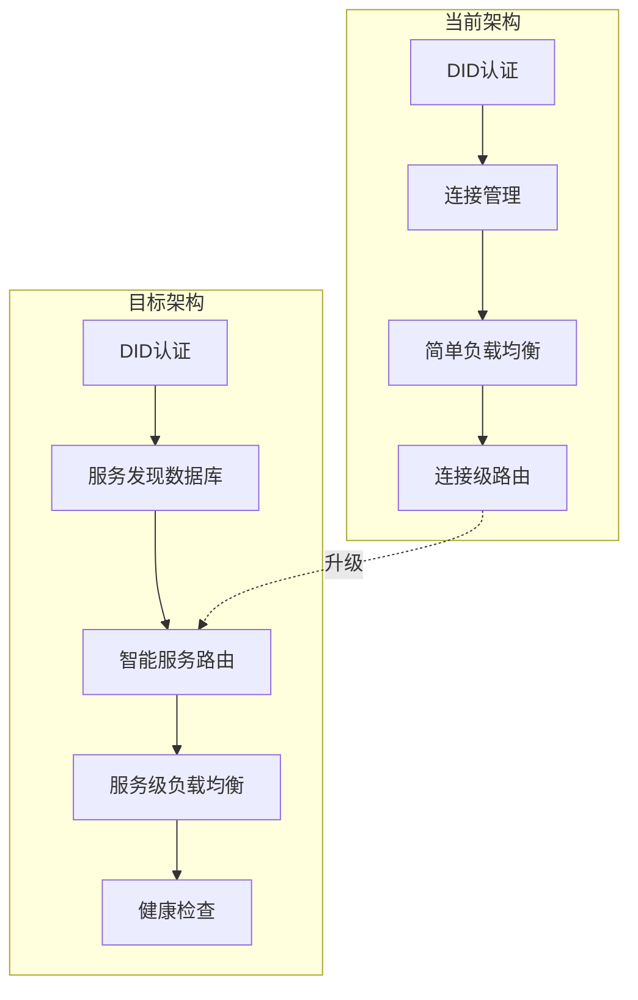
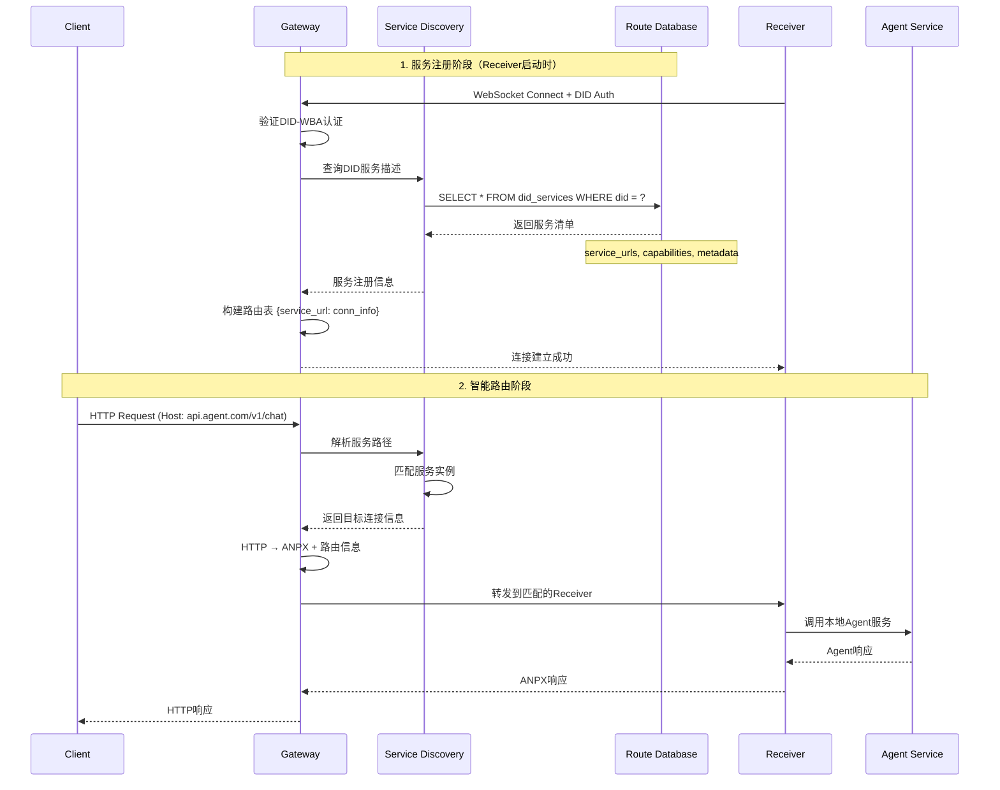
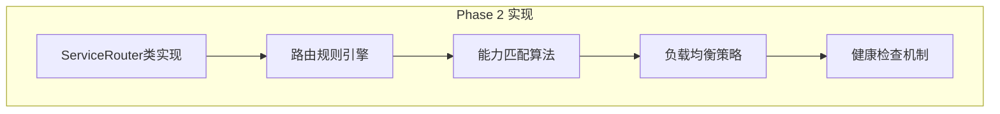
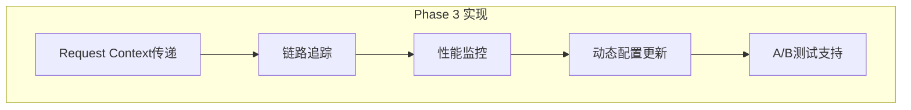

# AI Agent Infrastructure 升级方案

## 当前架构分析与升级需求

### 现状分析

**当前架构特点**:
- ✅ 基础的DID-WBA认证机制
- ✅ 简单的轮询负载均衡（基于pending requests）
- ✅ 连接级别的路由（connection_id → receiver）
- ❌ 缺少服务发现和智能路由
- ❌ 缺少基于业务逻辑的请求分发
- ❌ 缺少DID到服务的映射机制

**升级目标**:


## 核心升级设计

### 1. 服务发现与路由系统



### 2. 数据库Schema设计

```sql
-- DID服务描述表
CREATE TABLE did_services (
    id BIGINT PRIMARY KEY AUTO_INCREMENT,
    did VARCHAR(255) NOT NULL,
    service_url VARCHAR(500) NOT NULL,
    created_at TIMESTAMP DEFAULT CURRENT_TIMESTAMP,
    updated_at TIMESTAMP DEFAULT CURRENT_TIMESTAMP ON UPDATE CURRENT_TIMESTAMP,

    INDEX idx_did (did),
    INDEX idx_service_url (service_url),
    UNIQUE KEY uk_did_service (did, service_url)
);

-- 服务路由规则表
--
CREATE TABLE routing_rules (
    id BIGINT PRIMARY KEY AUTO_INCREMENT,
    rule_name VARCHAR(100) NOT NULL,
    path_pattern VARCHAR(500) NOT NULL, -- "/v1/chat/*", "/api/agents/{agent_id}/*"
    host_pattern VARCHAR(200),          -- "api.agent.com", "*.openai.proxy"
    method_pattern VARCHAR(50),         -- "POST", "GET|POST", "*"
    headers_match JSON,                 -- {"x-api-key": "required", "content-type": "application/json"}

    target_service_type VARCHAR(50),    -- "agent", "api"
    target_capability_filter JSON,     -- {"llm": "gpt-4", "tools": ["web_search"]}

    load_balance_strategy ENUM('round_robin', 'least_conn', 'capability_match', 'weighted') DEFAULT 'least_conn',
    priority INT DEFAULT 100,
    enabled BOOLEAN DEFAULT TRUE,

    created_at TIMESTAMP DEFAULT CURRENT_TIMESTAMP,
    INDEX idx_path (path_pattern),
    INDEX idx_host (host_pattern)
);

-- 实时连接状态表
CREATE TABLE active_connections (
    connection_id VARCHAR(100) PRIMARY KEY,
    did VARCHAR(255) NOT NULL,
    service_urls JSON,              -- ["api.agent.com/v1/chat", "api.agent.com/v1/completion"]
    connected_at TIMESTAMP DEFAULT CURRENT_TIMESTAMP,
    last_ping TIMESTAMP DEFAULT CURRENT_TIMESTAMP,
    pending_requests INT DEFAULT 0,
    total_requests BIGINT DEFAULT 0,
    health_status ENUM('healthy', 'degraded', 'unhealthy') DEFAULT 'healthy',

    INDEX idx_did (did),
    INDEX idx_health (health_status)
);
```

### 3. 智能路由算法

```python
# anp_proxy/gateway/service_router.py

from typing import Dict, List, Optional
from dataclasses import dataclass
from enum import Enum

class LoadBalanceStrategy(Enum):
    ROUND_ROBIN = "round_robin"
    LEAST_CONN = "least_conn"
    CAPABILITY_MATCH = "capability_match"
    WEIGHTED = "weighted"

@dataclass
class ServiceInstance:
    connection_id: str
    did: str
    service_url: str
    capabilities: Dict
    metadata: Dict
    health_status: str
    pending_requests: int
    weight: int = 100

class ServiceRouter:
    """智能服务路由器"""

    async def route_request(self, request_info: Dict) -> Optional[ServiceInstance]:
        """根据请求信息智能路由到最佳服务实例"""

        # 1. 规则匹配
        matching_rules = await self._match_routing_rules(request_info)

        # 2. 服务发现
        candidate_services = await self._discover_services(matching_rules)

        # 3. 健康过滤
        healthy_services = [s for s in candidate_services if s.health_status == 'healthy']

        # 4. 能力匹配
        capable_services = await self._filter_by_capabilities(healthy_services, request_info)

        # 5. 负载均衡选择
        selected_service = await self._select_by_load_balance(capable_services)

        return selected_service

    async def _match_routing_rules(self, request_info: Dict) -> list[Dict]:
        """匹配路由规则"""
        host = request_info.get('host', '')
        path = request_info.get('path', '')
        method = request_info.get('method', '')
        headers = request_info.get('headers', {})

        rules = []
        async with self.db_pool.acquire() as conn:
            async for row in conn.execute("""
                SELECT * FROM routing_rules
                WHERE enabled = TRUE
                AND (host_pattern = '*' OR %s LIKE host_pattern)
                AND (path LIKE REPLACE(path_pattern, '*', '%%'))
                AND (method_pattern = '*' OR FIND_IN_SET(%s, method_pattern))
                ORDER BY priority DESC
            """, (host, method)):
                rules.append(dict(row))

        return rules

    async def _filter_by_capabilities(self, services: list[ServiceInstance],
                                    request_info: Dict) -> list[ServiceInstance]:
        """基于能力匹配过滤服务"""
        if not request_info.get('required_capabilities'):
            return services

        matched_services = []
        required_caps = request_info['required_capabilities']

        for service in services:
            if self._check_capability_match(service.capabilities, required_caps):
                matched_services.append(service)

        return matched_services

    async def _select_by_load_balance(self, services: list[ServiceInstance]) -> Optional[ServiceInstance]:
        """负载均衡选择"""
        if not services:
            return None

        # 最少连接数算法
        return min(services, key=lambda s: s.pending_requests)
```

### 4. Gateway增强架构

```python
# anp_proxy/gateway/enhanced_server.py

class EnhancedGatewayServer(GatewayServer):
    """增强版Gateway服务器，支持智能路由"""

    def __init__(self, config: GatewayConfig):
        super().__init__(config)
        self.service_router = ServiceRouter(config.database)
        self.service_discovery = ServiceDiscovery(config.database)

    async def _handle_http_request(self, request: Request) -> Response:
        """增强的HTTP请求处理"""
        try:
            # 1. 提取请求信息
            request_info = await self._extract_request_info(request)

            # 2. 智能路由选择
            target_service = await self.service_router.route_request(request_info)
            if not target_service:
                return Response(content="No suitable service available", status_code=503)

            # 3. 请求映射与转发
            request_id, anpx_messages = await self.request_mapper.map_request(request)

            # 4. 添加路由信息到ANPX消息
            for message in anpx_messages:
                message.add_routing_info(target_service.service_url, target_service.metadata)

            # 5. 发送到指定连接
            success = await self.websocket_manager.send_to_connection(
                target_service.connection_id, request_id, anpx_messages
            )

            if not success:
                # 标记服务不健康，触发重路由
                await self.service_discovery.mark_unhealthy(target_service.connection_id)
                return await self._retry_with_fallback(request_info, request_id, anpx_messages)

            # 6. 等待响应
            return await self._wait_for_response(request_id)

        except Exception as e:
            logger.error("Enhanced request handling failed", error=str(e))
            return Response(content=f"Gateway error: {str(e)}", status_code=500)

    async def _extract_request_info(self, request: Request) -> Dict:
        """提取详细的请求信息用于路由决策"""
        return {
            'host': request.headers.get('host', ''),
            'path': str(request.url.path),
            'method': request.method,
            'headers': dict(request.headers),
            'query_params': dict(request.query_params),
            'user_agent': request.headers.get('user-agent', ''),
            'content_type': request.headers.get('content-type', ''),
            'required_capabilities': self._parse_capabilities_from_request(request)
        }
```

## 渐进式实现方案

### Phase 1: 数据库与服务发现 (Week 1-2)


**实现优先级**:
1. **数据库层**: 创建上述schema，实现基础CRUD操作
2. **服务发现**: 实现DID → service_urls的映射查询
3. **状态同步**: WebSocket连接建立时同步服务信息到数据库
4. **基础路由**: 实现简单的host/path模式匹配

### Phase 2: 智能路由引擎 (Week 3-4)



**核心功能**:
1. **规则引擎**: 支持复杂的路由规则匹配
2. **能力过滤**: 基于request requirements匹配service capabilities
3. **智能选择**: 综合负载、健康状态的服务选择
4. **故障转移**: 自动重路由和降级处理

### Phase 3: 高级特性与优化 (Week 5-6)



**企业级特性**:
1. **上下文传递**: 在ANPX协议中传递路由上下文
2. **监控体系**: 服务级别的性能指标收集
3. **配置热更新**: 支持路由规则的动态更新
4. **流量控制**: 实现灰度发布和A/B测试

## 技术实现细节

### 1. ANPX协议扩展

```python
# 扩展ANPX消息支持路由信息
class ANPXMessage:
    def add_routing_info(self, target_service: str, metadata: Dict):
        """添加路由信息到ANPX消息"""
        self.add_tlv_field(TLVTag.TARGET_SERVICE, target_service)
        self.add_tlv_field(TLVTag.SERVICE_METADATA, json.dumps(metadata))
        self.add_tlv_field(TLVTag.ROUTING_CONTEXT, {
            'selected_at': time.time(),
            'selection_reason': 'capability_match',
            'load_balance_strategy': 'least_conn'
        })
```

### 2. 数据库连接池

```python
# anp_proxy/common/database.py
import aiomysql
from typing import AsyncContextManager

class DatabasePool:
    """异步数据库连接池"""

    def __init__(self, config: DatabaseConfig):
        self.config = config
        self.pool: Optional[aiomysql.Pool] = None

    async def initialize(self):
        """初始化连接池"""
        self.pool = await aiomysql.create_pool(
            host=self.config.host,
            port=self.config.port,
            user=self.config.user,
            password=self.config.password,
            db=self.config.database,
            minsize=5,
            maxsize=20,
            autocommit=True
        )

    def acquire(self) -> AsyncContextManager:
        """获取数据库连接"""
        return self.pool.acquire()
```

### 3. 服务健康检查

```python
class HealthChecker:
    """服务健康检查器"""

    async def check_service_health(self, service_instance: ServiceInstance) -> bool:
        """检查服务实例健康状态"""
        if not service_instance.health_endpoint:
            return True  # 假设健康

        try:
            # 通过Receiver代理进行健康检查
            health_response = await self._proxy_health_check(service_instance)
            return health_response.status_code == 200
        except Exception:
            return False

    async def _proxy_health_check(self, service_instance: ServiceInstance):
        """通过现有的ANPX通道进行健康检查"""
        health_request = self._build_health_check_request(service_instance.health_endpoint)
        return await self.gateway.send_health_check(service_instance.connection_id, health_request)
```

## 总结

这个升级方案将ANP Proxy从简单的连接代理升级为**智能的AI Agent基础设施**，具备：

🚀 **核心能力**:
- DID身份到服务能力的智能映射
- 基于请求内容的智能路由
- 服务发现与动态负载均衡
- 健康检查与故障转移

🏗️ **架构优势**:
- 保持现有DID-WBA认证机制
- 渐进式升级，向后兼容
- 企业级的可观测性和可维护性
- 支持AI Agent的复杂路由需求

这个方案特别适合构建大规模的AI Agent集群，支持不同能力的Agent服务动态注册和智能调度，是真正的世界级AI基础设施。


 基于您的序列图需求，我已经制定了一套完整的升级方案，将现有的ANP
  Proxy架构提升为智能AI Agent基础设施。

  📋 核心升级亮点

  🔄 从简单代理到智能路由

  - 当前: DID认证 → 连接管理 → 轮询负载均衡
  - 升级后: DID认证 → 服务发现 → 能力匹配 → 智能路由

  🧠 智能路由核心算法

  # 四层路由决策
  1. 规则匹配: Host/Path/Method模式匹配
  2. 服务发现: DID → service_urls映射查询
  3. 能力过滤: 根据请求requirements过滤capable services
  4. 负载均衡: 综合健康状态、负载、权重的智能选择

  🗄️ 企业级数据库设计

  - did_services: DID到服务能力的映射表
  - routing_rules: 灵活的路由规则引擎
  - active_connections: 实时连接状态跟踪

  🚀 实施优势

  ✅ 向后兼容

  - 保持现有DID-WBA认证机制
  - 现有Receiver无需修改即可工作
  - 渐进式升级，零停机时间

  ⚡ 性能优化

  - 数据库连接池 (5-20连接)
  - 异步路由决策算法
  - 智能健康检查与故障转移

  🔍 企业级特性

  - 完整的链路追踪
  - 服务级性能监控
  - 动态配置热更新
  - A/B测试支持

  📅 3阶段实现路线图

  Phase 1 (Week 1-2): 🏗️ 基础设施

  graph LR
      A[数据库Schema] --> B[服务发现]
      B --> C[DID服务注册]
      C --> D[基础路由匹配]

  Phase 2 (Week 3-4): 🧠 智能路由

  graph LR
      A[路由引擎] --> B[能力匹配]
      B --> C[负载均衡]
      C --> D[健康检查]

  Phase 3 (Week 5-6): 🚀 高级特性

  graph LR
      A[链路追踪] --> B[性能监控]
      B --> C[动态配置]
      C --> D[流量控制]

  🎯 关键技术决策

  1. ANPX协议扩展

  - 添加路由上下文信息传递
  - 支持服务能力声明
  - 保持协议向后兼容

  2. 数据库选择建议

  - MySQL 8.0+: JSON字段支持，成熟的集群方案
  - 连接池: aiomysql实现高性能异步访问
  - 缓存层: Redis缓存热点路由规则

  3. 监控集成

  - Prometheus: 服务级指标收集
  - Jaeger: 分布式链路追踪
  - Grafana: 实时监控面板

  💡 最先实现建议

  作为世界级AI Agent Infrastructure开发工程师，我建议优先实现Phase
  1的服务发现机制：

  # 立即可以开始的最小可行实现
  class ServiceDiscovery:
      async def register_did_services(self, did: str, services:
  list[str]):
          """DID连接时注册其支持的服务列表"""
          pass

      async def resolve_service_url(self, host: str) ->
  Optional[str]:
          """根据Host header解析到目标connection_id"""
          pass

  这个设计将ANP Proxy从通用代理工具升级为专业AI
  Agent基础设施，支持:
  - 🤖 多AI Agent动态注册与发现
  - 🎯 基于能力的智能路由
  - 📊 全链路可观测性
  - 🔄 自动故障转移与负载均衡

  这正是构建大规模AI Agent生态系统所需要的核心基础设施！
