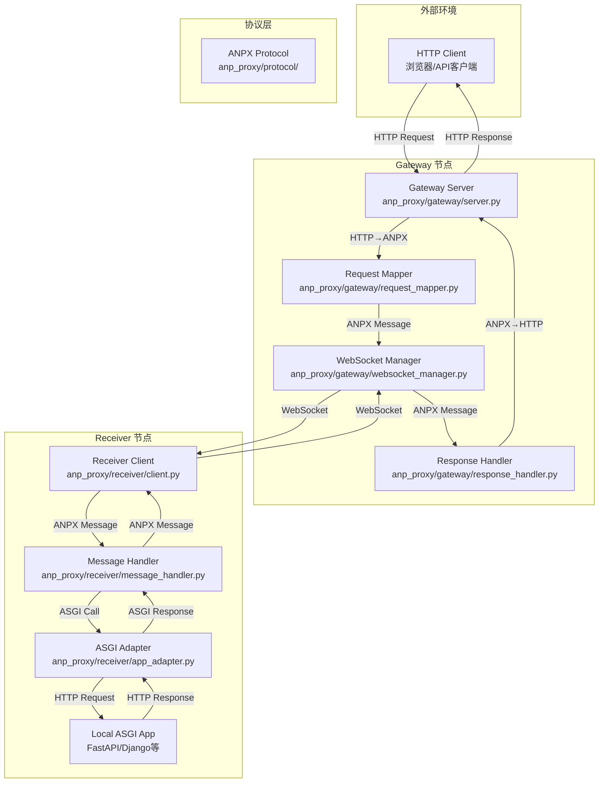
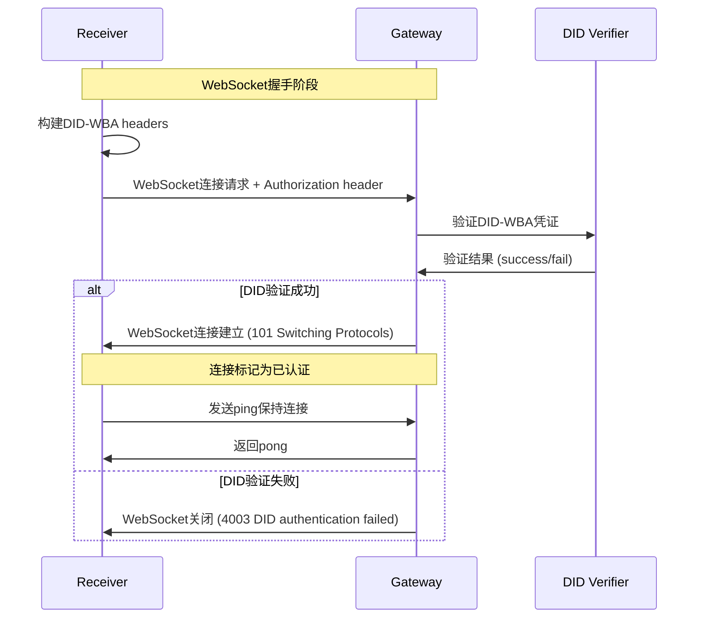
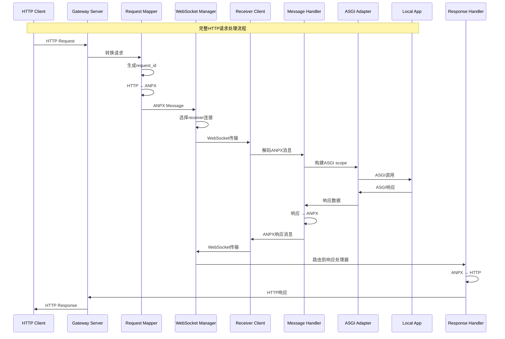

# ANP Proxy 数据流分析与模块交互

本文档详细分析 ANP Proxy 系统中 Client、Gateway、Receiver 三个核心模块之间的数据流变化和交互机制。

## 系统架构概览



## 核心数据流程

### 1. HTTP请求处理流程

#### 1.1 客户端请求接收 (Gateway)

**代码位置**: `anp_proxy/gateway/server.py:98-109`

```python
@app.api_route(
    "/{path:path}",
    methods=["GET", "POST", "PUT", "DELETE", "PATCH", "HEAD", "OPTIONS"],
    include_in_schema=False
)
async def proxy_request(request: Request, path: str) -> Response:
    """代理HTTP请求到receiver"""
    return await self._handle_http_request(request)
```

**关键特性**:
- 支持所有标准HTTP方法
- 使用FastAPI的catch-all路由捕获所有请求
- 通过中间件处理CORS、限流、安全headers

#### 1.2 请求映射与协议转换 (RequestMapper)

**代码位置**: `anp_proxy/gateway/request_mapper.py:26-72`

```python
async def map_request(self, request: Request) -> tuple[str, list[ANPXMessage]]:
    """将HTTP请求映射为ANPX消息"""
    # 生成唯一请求ID
    request_id = str(uuid.uuid4())

    # 提取HTTP组件
    method = request.method
    path = self._extract_path(request)
    headers = self._extract_headers(request)
    query = self._extract_query(request)
    body = await self._extract_body(request)

    # 编码为ANPX消息（支持分块传输）
    messages = self.encoder.encode_http_request(
        method=method, path=path, headers=headers,
        query=query, body=body, request_id=request_id
    )

    return request_id, messages
```

**数据转换过程**:
1. **UUID生成**: 为每个请求生成唯一标识符
2. **组件提取**: 分别提取HTTP方法、路径、headers、查询参数、请求体
3. **ANPX编码**: 使用ANPX协议编码器转换为二进制消息
4. **分块支持**: 大请求自动分块传输

#### 1.3 WebSocket消息转发 (WebSocketManager)

**代码位置**: `anp_proxy/gateway/websocket_manager.py:239-285`

```python
async def send_request(self, request_id: str, message: ANPXMessage) -> bool:
    """发送请求到receiver"""
    # 选择可用连接（负载均衡）
    available_connections = [
        conn for conn in self.connections.values()
        if conn.authenticated and len(conn.pending_requests) < 100
    ]

    if not available_connections:
        return False

    # 轮询选择最少pending requests的连接
    conn_info = min(available_connections, key=lambda c: len(c.pending_requests))

    # 发送消息并追踪路由
    await self._send_message(conn_info, message)
    self.request_routing[request_id] = conn_info.connection_id
    conn_info.pending_requests.add(request_id)

    return True
```

**负载均衡机制**:
- 基于连接的pending requests数量进行轮询
- 只选择已认证的连接
- 限制每个连接最多100个并发请求

### 2. WebSocket认证机制

#### 2.1 DID-WBA认证握手

**Gateway端验证** (`anp_proxy/gateway/websocket_manager.py:143-159`):

```python
async def _verify_did_headers(self, websocket: WebSocketServerProtocol):
    """验证DID-WBA headers during WS handshake"""
    try:
        # 提取域名
        domain = websocket.host or self.config.wss_host

        # 使用DID验证器验证Authorization header
        result = await self._did_wba_verifier.verify(websocket.request_headers, domain)
        if result.success:
            logger.info("DID-WBA authenticated", did=result.did)
        else:
            logger.warning("DID-WBA auth failed", error=result.error)
        return result
    except Exception as e:
        logger.error("DID-WBA verification error", error=str(e))
        return DidAuthResult(success=False, error=str(e))
```

**Receiver端认证** (`anp_proxy/receiver/client.py:147-174`):

```python
async def _connect_websocket(self) -> bool:
    """建立WebSocket连接到gateway"""
    # 构建DID-WBA认证headers
    extra_headers: dict[str, str] = build_auth_headers(self.config.auth, self.config.gateway_url)

    if extra_headers:
        self.websocket = await websockets.connect(
            self.config.gateway_url,
            extra_headers=extra_headers,
            ping_interval=self.config.ping_interval,
            ping_timeout=self.config.timeout,
            max_size=None,
            compression=None,
        )

    self.connected = True
    return True
```

#### 2.2 认证流程时序图



### 3. Receiver端处理机制

#### 3.1 消息接收与处理 (ReceiverClient)

**代码位置**: `anp_proxy/receiver/client.py:192-229`

```python
async def _message_loop(self) -> None:
    """主消息处理循环"""
    while self.connected and self.websocket:
        try:
            message = await self.websocket.recv()

            if isinstance(message, str):
                # 控制消息 (ping/pong)
                await self._handle_control_message(message)
            elif isinstance(message, bytes):
                # 二进制ANPX消息
                if self.message_handler:
                    await self.message_handler.handle_message(message)

        except websockets.exceptions.ConnectionClosed:
            logger.info("WebSocket connection closed")
            break
        except Exception as msg_error:
            logger.error("Error processing message", error=str(msg_error))
```

#### 3.2 ANPX到ASGI转换 (MessageHandler)

**代码位置**: `anp_proxy/receiver/message_handler.py`

```python
async def handle_message(self, message_data: bytes) -> None:
    """处理来自Gateway的ANPX消息"""
    # 解码ANPX消息
    message = self.decoder.decode_message(message_data)
    if not message:
        return

    if message.header.message_type == MessageType.HTTP_REQUEST:
        # 处理HTTP请求
        await self._handle_http_request(message)
    else:
        logger.warning("Unexpected message type", type=message.header.message_type)

async def _handle_http_request(self, message: ANPXMessage) -> None:
    """将ANPX请求转换为ASGI调用"""
    request_id = message.get_request_id()
    http_meta = message.get_http_meta()
    body = message.get_http_body()

    # 转换为ASGI scope
    scope = self._build_asgi_scope(http_meta, body)

    # 调用ASGI应用
    response_data = await self.asgi_adapter.call_asgi(scope, body)

    # 编码响应为ANPX
    response_messages = self.encoder.encode_http_response(
        status=response_data['status'],
        reason=response_data['reason'],
        headers=response_data['headers'],
        body=response_data['body'],
        request_id=request_id
    )

    # 发送响应回Gateway
    for resp_msg in response_messages:
        await self.send_callback(resp_msg)
```

#### 3.3 ASGI应用集成 (ASGIAdapter)

**代码位置**: `anp_proxy/receiver/app_adapter.py`

```python
async def call_asgi(self, scope: dict, body: bytes | None = None) -> dict:
    """调用ASGI应用并返回响应"""

    # 构建ASGI消息流
    receive_queue = asyncio.Queue()
    send_queue = asyncio.Queue()

    # 添加请求体到接收队列
    if body:
        await receive_queue.put({
            'type': 'http.request',
            'body': body,
            'more_body': False
        })
    else:
        await receive_queue.put({
            'type': 'http.request',
            'body': b'',
            'more_body': False
        })

    # 调用ASGI应用
    await self.app(scope, receive_queue.get, send_queue.put)

    # 收集响应
    response_data = await self._collect_response(send_queue)
    return response_data
```

### 4. 响应回传机制

#### 4.1 响应处理与等待 (ResponseHandler)

**代码位置**: `anp_proxy/gateway/response_handler.py:75-127`

```python
async def create_pending_request(self, request_id: str, timeout: float | None = None) -> PendingRequest:
    """创建待处理请求对象"""
    timeout = timeout or self.default_timeout
    pending_request = PendingRequest(request_id, timeout)
    self.pending_requests[request_id] = pending_request
    return pending_request

async def handle_response(self, request_id: str, message: ANPXMessage) -> None:
    """处理来自receiver的响应"""
    pending_request = self.pending_requests.pop(request_id, None)
    if not pending_request:
        logger.warning("Received response for unknown request", request_id=request_id)
        return

    try:
        # 转换ANPX响应为HTTP响应
        response = await self._convert_to_http_response(message)
        pending_request.complete(response)
    except Exception as e:
        pending_request.error(e)
```

#### 4.2 完整请求-响应时序图



### 5. 错误处理与恢复机制

#### 5.1 连接管理与重连

**代码位置**: `anp_proxy/receiver/reconnect.py`

```python
class ReconnectManager:
    """WebSocket重连管理器"""

    async def connect(self) -> bool:
        """尝试连接到gateway"""
        self.state = ConnectionState.CONNECTING

        for attempt in range(self.config.max_reconnect_attempts):
            try:
                success = await self.connect_callback()
                if success:
                    self.state = ConnectionState.CONNECTED
                    self.consecutive_failures = 0
                    return True

            except Exception as e:
                logger.warning(f"Connection attempt {attempt + 1} failed: {e}")

            # 指数退避延迟
            delay = min(self.config.reconnect_delay * (2 ** attempt), 300)
            await asyncio.sleep(delay)

        self.state = ConnectionState.FAILED
        return False
```

#### 5.2 请求超时处理

**代码位置**: `anp_proxy/gateway/response_handler.py:34-37`

```python
def _timeout_callback(self) -> None:
    """处理请求超时"""
    if not self.future.done():
        self.future.set_exception(TimeoutError(f"Request {self.request_id} timed out"))
```

#### 5.3 连接清理机制

**代码位置**: `anp_proxy/gateway/websocket_manager.py:330-357`

```python
async def _cleanup_loop(self) -> None:
    """周期性清理陈旧连接和请求"""
    while True:
        try:
            await asyncio.sleep(60)  # 每分钟清理一次

            current_time = asyncio.get_event_loop().time()
            stale_connections = []

            for conn_id, conn_info in self.connections.items():
                # 检查连接是否陈旧（2倍ping间隔无响应）
                if current_time - conn_info.last_ping > self.config.ping_interval * 2:
                    stale_connections.append(conn_id)

            # 关闭陈旧连接
            for conn_id in stale_connections:
                conn_info = self.connections.get(conn_id)
                if conn_info:
                    await conn_info.websocket.close()

        except asyncio.CancelledError:
            break
```

## 性能优化要点

### 1. 消息分块传输
- 支持大文件自动分块（默认64KB）
- 避免WebSocket消息过大导致的内存问题
- 流式传输减少延迟

### 2. 连接池管理
- 支持多个receiver连接
- 基于pending requests的负载均衡
- 连接健康检查和自动清理

### 3. 异步处理
- 全异步架构避免阻塞
- 并发请求处理
- 超时机制防止资源泄露

### 4. 协议优化
- 二进制ANPX协议减少序列化开销
- TLV编码支持灵活的数据结构
- 压缩和优化传输

这个架构设计实现了高效、可靠的HTTP over WebSocket代理系统，支持认证、负载均衡、错误恢复等企业级特性。
