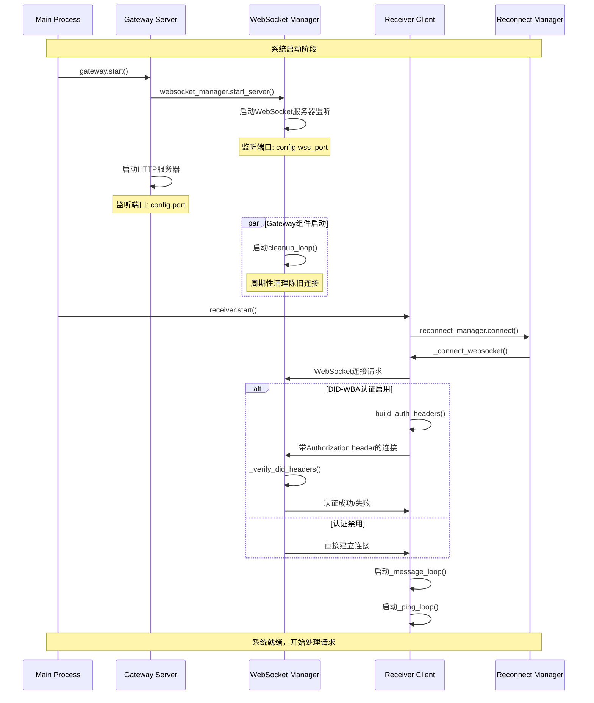
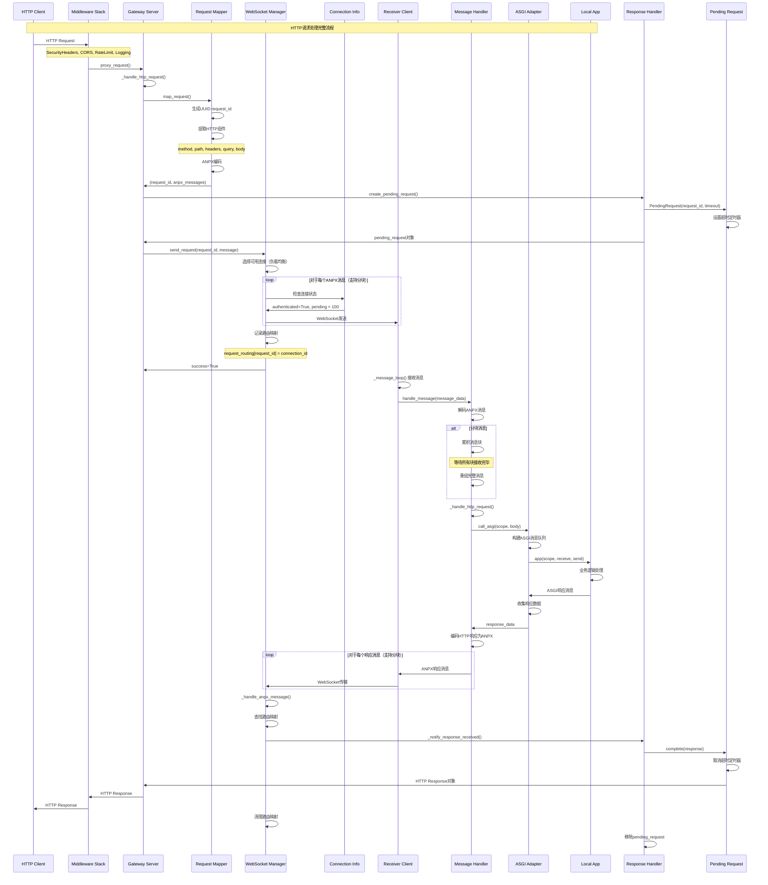
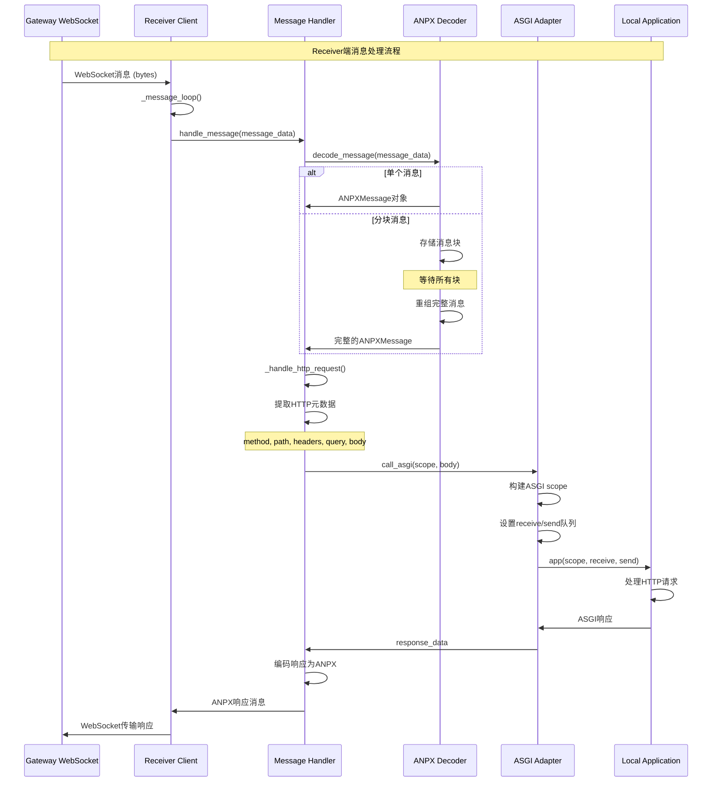
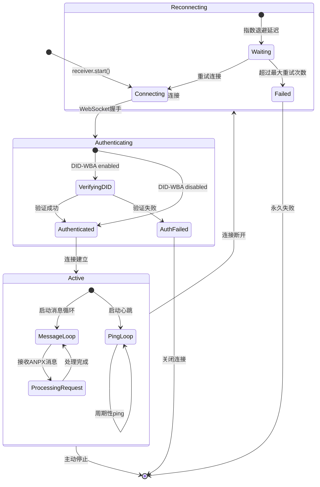
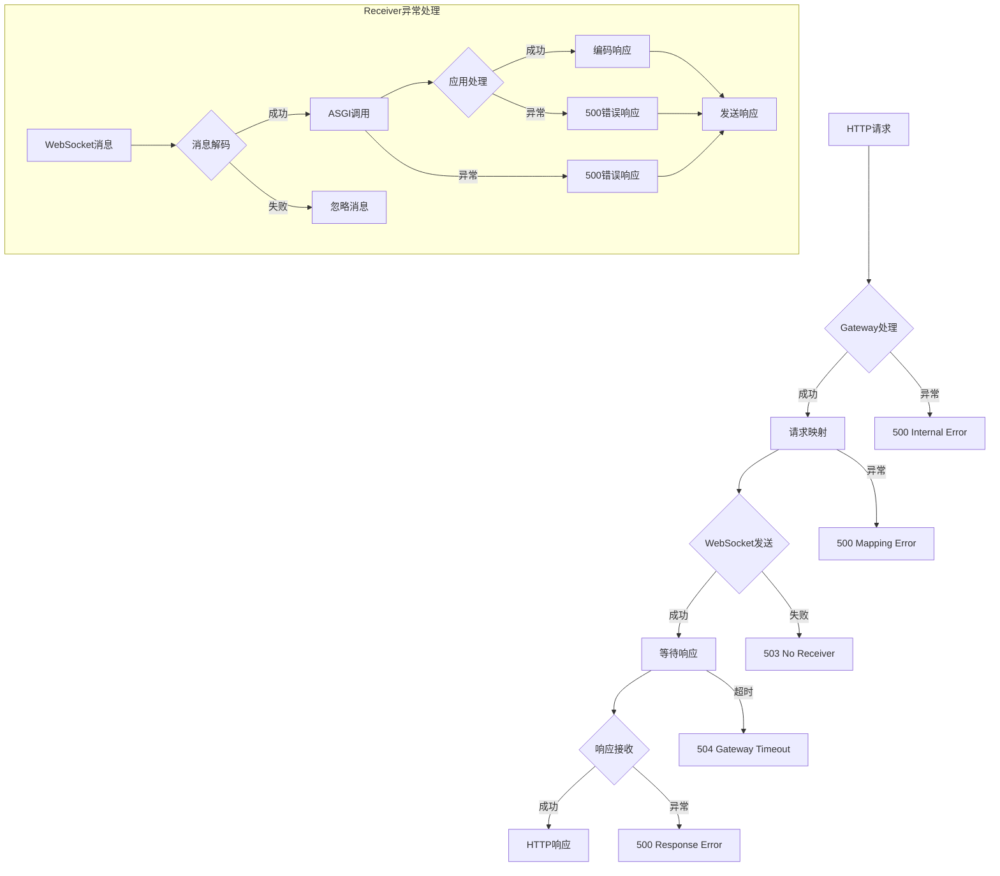

# ANP Proxy 交互时序分析与代码执行流程

本文档详细分析 ANP Proxy 系统各组件间的交互时序，包含具体的代码执行路径和数据变换过程。

## 1. 系统启动时序

### 1.1 组件启动顺序



### 1.2 启动代码分析

**Gateway启动流程** (`anp_proxy/gateway/server.py:196-227`):

```python
async def start(self) -> None:
    """启动gateway服务器"""
    try:
        # 1. 首先启动WebSocket服务器
        await self.websocket_manager.start_server()

        # 2. 启动HTTP服务器
        config = uvicorn.Config(
            app=self.app,
            host=self.config.host,
            port=self.config.port,
            log_config=None,
            access_log=False,
            server_header=False,
            date_header=False
        )

        server = uvicorn.Server(config)
        self._server_task = asyncio.create_task(server.serve())

        logger.info("Gateway server started",
                   http_host=self.config.host,
                   http_port=self.config.port)
    except Exception as e:
        logger.error("Failed to start gateway server", error=str(e))
        await self.stop()
        raise
```

**WebSocket服务器启动** (`anp_proxy/gateway/websocket_manager.py:53-78`):

```python
async def start_server(self) -> None:
    """启动WebSocket服务器"""
    try:
        self._server = await websockets.serve(
            self._handle_connection,  # 连接处理函数
            self.config.wss_host,
            self.config.wss_port,
            ping_interval=self.config.ping_interval,
            ping_timeout=self.config.timeout,
            max_size=None,  # 无大小限制，支持大文件传输
            compression=None  # 禁用压缩，使用二进制协议
        )

        # 启动清理任务
        self._cleanup_task = asyncio.create_task(self._cleanup_loop())

        logger.info("WebSocket server started",
                   host=self.config.wss_host,
                   port=self.config.wss_port,
                   tls_enabled=self.config.tls.enabled)
    except Exception as e:
        logger.error("Failed to start WebSocket server", error=str(e))
        raise
```

## 2. HTTP请求完整处理时序

### 2.1 详细请求处理流程



### 2.2 核心代码执行路径分析

#### 2.2.1 HTTP请求接收与处理

**Gateway HTTP处理入口** (`anp_proxy/gateway/server.py:111-175`):

```python
async def _handle_http_request(self, request: Request) -> Response:
    """处理传入的HTTP请求"""
    try:
        # 步骤1: HTTP请求映射为ANPX消息
        request_id, anpx_messages = await self.request_mapper.map_request(request)

        # 步骤2: 创建待处理请求用于响应跟踪
        pending_request = await self.response_handler.create_pending_request(
            request_id, self.config.timeout
        )

        # 步骤3: 发送请求到receiver通过WebSocket
        success = False
        for message in anpx_messages:  # 支持分块消息
            if await self.websocket_manager.send_request(request_id, message):
                success = True
            else:
                break

        if not success:
            # 无可用receiver - 返回503错误
            error_messages = self.request_mapper.create_error_response_message(
                request_id, status=503, message="No receiver available"
            )
            return await self._convert_anpx_to_response(error_messages[0])

        # 步骤4: 等待响应
        try:
            response = await pending_request.wait()  # 阻塞等待响应或超时
            return response
        except TimeoutError:
            return Response(content="Request timeout", status_code=504)

    except Exception as e:
        logger.error("Failed to handle HTTP request", error=str(e))
        return Response(content=f"Internal server error: {str(e)}", status_code=500)
```

#### 2.2.2 请求映射与ANPX编码

**RequestMapper核心逻辑** (`anp_proxy/gateway/request_mapper.py:26-76`):

```python
async def map_request(self, request: Request) -> tuple[str, list[ANPXMessage]]:
    """映射HTTP请求到ANPX协议消息"""
    try:
        # 生成唯一请求标识符
        request_id = str(uuid.uuid4())

        # 提取HTTP请求各组件
        method = request.method
        path = self._extract_path(request)      # 路径 + fragment
        headers = self._extract_headers(request) # 包含客户端IP转发
        query = self._extract_query(request)    # 查询参数
        body = await self._extract_body(request) # 请求体（考虑content-length）

        logger.debug("Mapping HTTP request",
                    request_id=request_id,
                    method=method, path=path,
                    body_size=len(body) if body else 0)

        # 使用ANPX编码器转换为协议消息
        # 大请求会自动分块处理
        messages = self.encoder.encode_http_request(
            method=method, path=path, headers=headers,
            query=query, body=body, request_id=request_id
        )

        logger.debug("HTTP request mapped to ANPX",
                    request_id=request_id,
                    message_count=len(messages),
                    is_chunked=len(messages) > 1)

        return request_id, messages

    except Exception as e:
        logger.error("Failed to map HTTP request", error=str(e))
        raise
```

#### 2.2.3 负载均衡与连接选择

**WebSocket连接选择算法** (`anp_proxy/gateway/websocket_manager.py:250-285`):

```python
async def send_request(self, request_id: str, message: ANPXMessage) -> bool:
    """发送请求到receiver（支持负载均衡）"""
    # 筛选可用连接
    available_connections = [
        conn for conn in self.connections.values()
        if conn.authenticated and len(conn.pending_requests) < 100  # 并发限制
    ]

    if not available_connections:
        logger.warning("No available connections for request", request_id=request_id)
        return False

    # 负载均衡：选择pending requests最少的连接
    conn_info = min(available_connections, key=lambda c: len(c.pending_requests))

    try:
        # 发送消息到选中的连接
        await self._send_message(conn_info, message)

        # 记录请求路由，用于响应回传
        self.request_routing[request_id] = conn_info.connection_id
        conn_info.pending_requests.add(request_id)

        logger.debug("Request sent to receiver",
                    request_id=request_id,
                    connection_id=conn_info.connection_id,
                    pending_count=len(conn_info.pending_requests))
        return True

    except Exception as e:
        logger.error("Failed to send request",
                    request_id=request_id,
                    connection_id=conn_info.connection_id,
                    error=str(e))
        return False
```

## 3. Receiver端消息处理流程

### 3.1 消息接收与解码时序



### 3.2 ASGI适配器实现分析

**ASGI调用实现** (`anp_proxy/receiver/app_adapter.py`):

```python
async def call_asgi(self, scope: dict, body: bytes | None = None) -> dict:
    """调用ASGI应用并收集响应"""

    # 创建消息队列用于ASGI通信
    receive_queue = asyncio.Queue()
    send_queue = asyncio.Queue()

    # 构建请求体消息
    if body:
        await receive_queue.put({
            'type': 'http.request',
            'body': body,
            'more_body': False  # 表示请求体完整
        })
    else:
        await receive_queue.put({
            'type': 'http.request',
            'body': b'',
            'more_body': False
        })

    async def receive():
        """ASGI receive接口实现"""
        return await receive_queue.get()

    async def send(message):
        """ASGI send接口实现"""
        await send_queue.put(message)

    # 调用ASGI应用
    try:
        await self.app(scope, receive, send)
    except Exception as e:
        logger.error("ASGI application error", error=str(e))
        raise

    # 收集响应数据
    response_data = await self._collect_response(send_queue)
    return response_data

async def _collect_response(self, send_queue: asyncio.Queue) -> dict:
    """从send队列收集完整的HTTP响应"""
    status = 200
    headers = {}
    body_parts = []

    while True:
        try:
            message = await asyncio.wait_for(send_queue.get(), timeout=1.0)

            if message['type'] == 'http.response.start':
                status = message['status']
                headers = dict(message.get('headers', []))

            elif message['type'] == 'http.response.body':
                body_parts.append(message.get('body', b''))
                if not message.get('more_body', False):
                    break  # 响应体完整

        except asyncio.TimeoutError:
            break  # 超时退出

    # 合并响应体
    body = b''.join(body_parts)

    return {
        'status': status,
        'reason': self._get_reason_phrase(status),
        'headers': headers,
        'body': body
    }
```

## 4. WebSocket连接管理详细分析

### 4.1 连接生命周期管理



### 4.2 连接清理与健康检查

**Gateway端连接清理** (`anp_proxy/gateway/websocket_manager.py:330-357`):

```python
async def _cleanup_loop(self) -> None:
    """周期性清理陈旧连接和请求"""
    while True:
        try:
            await asyncio.sleep(60)  # 每分钟执行一次清理

            current_time = asyncio.get_event_loop().time()
            stale_connections = []

            # 识别陈旧连接
            for conn_id, conn_info in self.connections.items():
                # 检查是否超过2倍ping间隔无响应
                if current_time - conn_info.last_ping > self.config.ping_interval * 2:
                    stale_connections.append(conn_id)

            # 关闭陈旧连接
            for conn_id in stale_connections:
                conn_info = self.connections.get(conn_id)
                if conn_info:
                    logger.warning("Closing stale connection", connection_id=conn_id)
                    await conn_info.websocket.close()

            # 清理解码器中的陈旧消息块
            self.decoder.cleanup_stale_chunks()

        except asyncio.CancelledError:
            break
        except Exception as e:
            logger.error("Error in cleanup loop", error=str(e))
```

**Receiver端重连机制** (`anp_proxy/receiver/reconnect.py`):

```python
async def connect(self) -> bool:
    """带重试的连接建立"""
    self.state = ConnectionState.CONNECTING

    for attempt in range(self.config.max_reconnect_attempts):
        try:
            logger.info(f"Connection attempt {attempt + 1}/{self.config.max_reconnect_attempts}")

            # 调用连接回调（实际建立WebSocket连接）
            success = await self.connect_callback()
            if success:
                self.state = ConnectionState.CONNECTED
                self.consecutive_failures = 0
                self.last_success_time = time.time()
                return True

        except Exception as e:
            logger.warning(f"Connection attempt {attempt + 1} failed: {e}")
            self.consecutive_failures += 1

        # 指数退避延迟，避免频繁重连
        delay = min(self.config.reconnect_delay * (2 ** attempt), 300)  # 最大5分钟
        logger.info(f"Waiting {delay}s before retry...")
        await asyncio.sleep(delay)

    # 所有重试都失败
    self.state = ConnectionState.FAILED
    logger.error("All connection attempts failed")
    return False
```

## 5. 错误处理与异常恢复

### 5.1 异常处理层级



### 5.2 超时与重试机制

**请求超时处理** (`anp_proxy/gateway/response_handler.py:14-57`):

```python
class PendingRequest:
    """待处理请求对象，支持超时处理"""

    def __init__(self, request_id: str, timeout: float = 300.0) -> None:
        self.request_id = request_id
        self.future: asyncio.Future[Response] = asyncio.Future()
        self.timeout = timeout

        # 设置超时回调
        loop = asyncio.get_event_loop()
        self.timeout_handle: asyncio.Handle | None = loop.call_later(
            timeout, self._timeout_callback
        )

    def _timeout_callback(self) -> None:
        """超时回调函数"""
        if not self.future.done():
            self.future.set_exception(
                TimeoutError(f"Request {self.request_id} timed out after {self.timeout}s")
            )

    def complete(self, response: Response) -> None:
        """完成请求"""
        if self.timeout_handle:
            self.timeout_handle.cancel()  # 取消超时定时器

        if not self.future.done():
            self.future.set_result(response)

    async def wait(self) -> Response:
        """等待请求完成或超时"""
        return await self.future
```

## 6. 性能优化与监控

### 6.1 性能关键指标

**连接统计** (`anp_proxy/gateway/websocket_manager.py:359-370`):

```python
def get_connection_stats(self) -> dict[str, Any]:
    """获取连接统计信息"""
    total_connections = len(self.connections)
    authenticated_connections = sum(1 for c in self.connections.values() if c.authenticated)
    total_pending_requests = sum(len(c.pending_requests) for c in self.connections.values())

    return {
        "total_connections": total_connections,
        "authenticated_connections": authenticated_connections,
        "total_pending_requests": total_pending_requests,
        "request_routing_entries": len(self.request_routing),
        # 性能指标
        "avg_pending_per_connection": total_pending_requests / max(total_connections, 1),
        "connection_utilization": authenticated_connections / max(total_connections, 1)
    }
```

### 6.2 内存优化与资源管理

**消息块清理** (`anp_proxy/protocol/decoder.py`):

```python
def cleanup_stale_chunks(self, max_age: float = 300.0) -> int:
    """清理陈旧的消息块，避免内存泄漏"""
    current_time = time.time()
    stale_chunks = []

    for chunk_id, chunk_data in self.chunk_buffer.items():
        if current_time - chunk_data.last_update > max_age:
            stale_chunks.append(chunk_id)

    # 清理陈旧块
    for chunk_id in stale_chunks:
        del self.chunk_buffer[chunk_id]
        logger.debug("Cleaned stale chunk", chunk_id=chunk_id)

    return len(stale_chunks)
```

这个详细的交互分析展示了 ANP Proxy 系统各组件间精密的协作机制，包含完整的错误处理、性能优化和资源管理策略。
